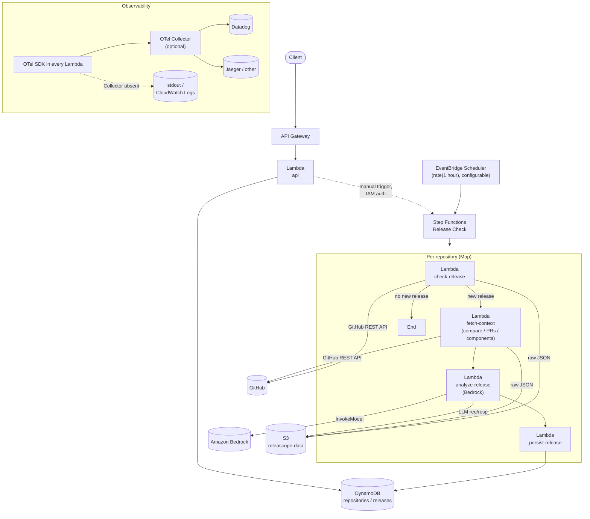
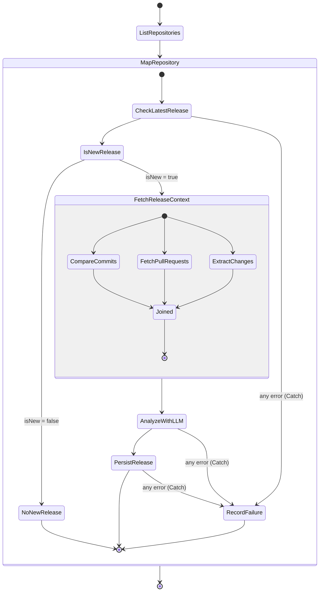

# Releascope

Releascope watches OSS GitHub repositories for new releases, gathers the
context around each release (release notes, commit compare, pull
requests), asks an LLM (Amazon Bedrock) to explain what the release
means for someone operating that software, and makes the result
available through a REST API.

The MVP tracks:

- `open-telemetry/opentelemetry-collector`
- `open-telemetry/opentelemetry-collector-contrib`

Equally important: Releascope is built to be an **Observability
Playground**. Every architectural decision below was made with "can I
see this in a trace/metric/log?" as a first-class concern, not an
afterthought - see [Observability](#observability) for the parts that
matter most.

---

## Table of contents

- [Architecture](#architecture)
- [Workflow](#workflow-step-functions)
- [Data model](#data-model)
- [API](#api)
- [Deploy](#deploy)
- [Local development](#local-development)
- [Observability](#observability)
- [Fault injection](#fault-injection)
- [Testing](#testing)
- [Implementation phases](#implementation-phases)
- [MVP completion checklist](#mvp-completion-checklist)
- [Known limitations / future work](#known-limitations--future-work)

---

## Architecture



Two independent flows, sharing `internal/*` packages but never sharing
Lambda deployables:

1. **Release Check workflow** (scheduled + manually triggerable) -
   write path, produces `releases` records.
2. **Read API** (API Gateway + one Lambda) - read path, serves what the
   workflow persisted. It never touches GitHub, Bedrock, or S3 raw data
   directly (spec section 26: raw data is never exposed through the
   API).

### Why these AWS services

Every piece is serverless/pay-per-use on purpose (spec section 27's
cost priority): no NAT Gateway, no always-on ECS/Fargate, no RDS. The
one component that *could* need to run continuously - an OpenTelemetry
Collector - is explicitly optional; every Lambda falls back to writing
OTLP data to stdout (picked up by CloudWatch Logs) when
`OTEL_EXPORTER_OTLP_ENDPOINT` is unset, so the system is fully
functional with zero Collector cost, and a Collector is something you
turn on only when you're actively doing an Observability experiment.

### Package layout

```
cmd/
  api/              REST API Lambda
  check-release/    Step Functions task 1 (also the local CLI)
  fetch-context/    Step Functions tasks 2-4 (one binary, action-routed)
  analyze-release/  Step Functions task 5 (Bedrock)
  persist-release/  Step Functions task 6 (DynamoDB)

internal/
  apperr/         closed set of error categories + OTel span-error recording
  apihandlers/    API Gateway request routing/handlers
  awsconfig/      aws.Config loader with otelaws instrumentation wired in
  bedrock/        Bedrock client (structured output via tool use)
  bootstrap/      shared main()-time wiring (config/logging/telemetry/AWS)
  config/         environment variable loading
  fault/          fault injection (spec section 21)
  github/         GitHub REST API client
  lambdautil/     thin Lambda-runtime glue (error mapping, cold start)
  logging/        JSON structured logging w/ trace correlation
  release/        pure domain logic: version compare, component extraction, models
  service/        use-case layer called by both Lambda handlers and the local CLI
  storage/        DynamoDB + S3 access
  telemetry/      OpenTelemetry SDK bootstrap, metrics, trace-context propagation helpers

infra/terraform/  all AWS infrastructure
```

`internal/service` is the layer that matters for "Lambda Handler は薄く
保つ" (spec section 14): every `cmd/*/main.go` is ~40 lines of wiring
plus a one-line call into `service.XxxRelease(...)`. None of
`internal/service`, `internal/github`, `internal/bedrock`,
`internal/release`, or `internal/storage` import `aws-lambda-go` - they
are plain Go, runnable from a unit test or a CLI with no Lambda runtime
involved.

---

## Workflow (Step Functions)



The full ASL is generated from
[`infra/terraform/statemachine.asl.json.tftpl`](infra/terraform/statemachine.asl.json.tftpl)
(a Terraform `templatefile()` that fills in the 4 Lambda ARNs and the
Map's `MaxConcurrency`). It uses every state type spec section 5 asks
for:

| Feature | Where |
|---|---|
| **Map** | `MapRepository` - one iteration per tracked repository, `MaxConcurrency` from `var.map_max_concurrency` |
| **Parallel** | `FetchReleaseContext` - Compare / PullRequests / ExtractChanges run concurrently as three independently-retried Task states |
| **Choice** | `IsNewRelease` - short-circuits to `NoNewRelease` when nothing changed |
| **Retry** | every Task classifies errors into `github_rate_limit` / `github_timeout` / `github_server_error` / `bedrock_throttling` / `bedrock_timeout` / `bedrock_invalid_response` / `storage_error`, each with its own exponential backoff (`BackoffRate: 2.0`) |
| **Catch** | every Task catches `States.ALL` into a per-iteration `RecordFailure` Pass state, so one repository's failure never blocks the others in the Map |

**Why one Lambda per side of a Parallel branch, and one Lambda handling
three branches**: `fetch-context` is a single deployable that
dispatches on an `action` field (`compare` / `pull_requests` /
`extract_changes`) rather than three separate Lambda functions. Step
Functions still schedules the three branches as genuinely independent,
concurrently-run, individually-retried Task states - the sharing is
purely about *deployment unit* count (spec section 14: don't copy Lambda
implementations, share `internal/` packages), not about workflow
semantics.

**Idempotency** (spec section 6): `persist-release` writes the release
record and advances the repository's `latestVersion` pointer in one
DynamoDB `TransactWriteItems` call, keyed entirely by
`(repository, version)`. Replaying the exact same release - whether
because Step Functions retried a task, or because you called the manual
`/check` endpoint twice - produces the identical item both times.
`check-release`'s S3 writes use the same deterministic-key property:
`releases/<owner>/<repo>/<version>/release.json` etc. always resolve to
the same object.

---

## Data model

DynamoDB, two tables, deliberately not single-table design (spec
section 10: "まずは理解しやすさを優先する").

**`repositories`** - PK `repository`

| attribute | |
|---|---|
| `repository` | `"open-telemetry/opentelemetry-collector-contrib"` |
| `latestVersion`, `latestPublishedAt` | pointer to the newest known release |
| `lastCheckedAt`, `createdAt`, `updatedAt` | |

**`releases`** - PK `repository`, SK `version`, GSI
`repository-publishedAt-index` (PK `repository`, SK `publishedAt`)

| attribute | |
|---|---|
| `repository`, `version`, `previousVersion`, `publishedAt`, `releaseUrl` | |
| `summary`, `breakingChanges[]`, `notableChanges[]`, `deprecations[]`, `risk`, `migrationRequired`, `recommendation` | Bedrock structured output (spec section 8) |
| `affectedComponents[]` | OTel Collector Contrib component names (spec section 9), merged from both the LLM's own output and a regex pass over PR titles/release notes |
| `rawDataS3Uri`, `llmRawResponseS3Uri` | pointers into S3 for debugging |
| `createdAt` | |

The GSI exists because `version` strings do not sort correctly as plain
strings once a repository passes 100 releases (`"v0.99.0" >
"v0.100.0"` lexicographically) - listing "newest first" queries the GSI
by `publishedAt` instead of relying on the base table's sort key.

S3 layout (`internal/storage.ReleaseDataKey`):

```
s3://releascope-data/releases/<owner>/<repo>/<version>/
  release.json           # current release metadata (check-release)
  previous-release.json  # previous release metadata, if any (check-release)
  compare.json           # GitHub compare API response (fetch-context)
  pull-requests.json     # merged PRs in the release window (fetch-context)
  llm-request.json       # exact prompt/schema sent to Bedrock (analyze-release)
  llm-response.json      # raw Bedrock response, incl. non-tool_use text (analyze-release)
```

---

## API

| Method | Path | Auth | Notes |
|---|---|---|---|
| GET | `/repositories` | none | tracked repositories + latest known version |
| GET | `/repositories/{owner}/{repo}/releases` | none | `?limit=20&cursor=...` pagination |
| GET | `/repositories/{owner}/{repo}/releases/{version}` | none | full record incl. S3 URIs |
| POST | `/repositories/{owner}/{repo}/check` | **AWS_IAM** | starts a Step Functions execution for one repository; returns `{"executionArn": "..."}` |

The manual-trigger endpoint exists for Observability Playground use
(spec section 13) - being able to fire an execution on demand, from a
terminal, is much faster than waiting for the next hourly schedule when
you're watching a trace live. It requires SigV4-signed requests from a
principal holding the `invoke_manual_check` IAM policy Terraform
outputs; it is **not** public.

```bash
aws apigateway test-invoke-method \
  --rest-api-id <id> --resource-id <check-resource-id> --http-method POST
# or, with a SigV4-capable HTTP client / awscurl:
awscurl --service execute-api -X POST \
  "$API_BASE_URL/repositories/open-telemetry/opentelemetry-collector-contrib/check"
```

---

## Deploy

Prerequisites: Go 1.25+ (the toolchain directive in `go.mod` will fetch
it automatically via `GOTOOLCHAIN=auto` if your local Go is older),
Terraform >= 1.7, an AWS account with Bedrock model access enabled for
the model in `bedrock_model_id`.

```bash
# 1. Build every Lambda into infra/terraform's expected zip layout.
make build-lambdas

# 2. Provision AWS resources.
cd infra/terraform
cp terraform.tfvars.example terraform.tfvars   # edit as needed
terraform init
terraform plan
terraform apply

# 3. Set the real GitHub token (never put this in .tfvars or state -
#    Terraform only creates the parameter shell, see ssm.tf).
aws ssm put-parameter \
  --name "$(terraform output -raw github_token_parameter_name)" \
  --type SecureString --overwrite \
  --value "ghp_..."
```

From here:

- The schedule (`var.schedule_expression`, default `rate(1 hour)`) will
  start firing `release-check` executions automatically.
- `terraform output api_base_url` gives you the read API's base URL.
- Re-running `make build-lambdas && terraform apply` after a code change
  updates every Lambda (the zip's hash is the `source_code_hash`
  Terraform diffs against).

### GitHub token scope

A fine-grained PAT with only public-repo read access is enough (the two
MVP repositories are public). Without a token, GitHub's unauthenticated
rate limit (60 req/hr) will exhaust quickly across two repositories
checked hourly with PR/compare lookups - configure a token even for
casual/demo use.

---

## Local development

```bash
make test              # go test ./... -race -cover
make lint              # go vet (+ golangci-lint if installed)
make build             # go build ./... (host platform, fast sanity check)
make build-lambdas     # cross-compile + zip every Lambda for Terraform

# Run the release checker against a real GitHub repo, no AWS Lambda
# runtime involved - only DynamoDB/S3 calls need real AWS credentials
# (export AWS_PROFILE=... or run against your dev account).
REPOSITORY=open-telemetry/opentelemetry-collector-contrib \
REPOSITORY_TABLE_NAME=releascope-repositories \
DATA_BUCKET_NAME=releascope-data \
GITHUB_TOKEN=ghp_... \
make check-release
```

`cmd/check-release/main.go` detects whether it's running inside the
real Lambda runtime (`AWS_LAMBDA_RUNTIME_API` env var) and, if not,
invokes its own handler directly and prints the JSON result to stdout
instead of calling `lambda.Start` - this is what makes `make
check-release` work without any Lambda emulation (spec section 24).

---

## Observability

This is the part of the spec Releascope treats as a product requirement
in its own right, not a nice-to-have.

### Trace propagation - what works, what doesn't, and how it's bridged

| Boundary | Propagation | How |
|---|---|---|
| Client → API Gateway → Lambda (`api`) | **Real W3C Trace Context** | API Gateway forwards the client's `traceparent`/`baggage` headers unchanged into the Lambda proxy event; `internal/telemetry.ExtractHTTPHeaders` extracts them before the `api.request` span starts. If the client sends no `traceparent`, the span simply becomes a fresh root - genuine propagation, not simulated. |
| Lambda (`api`) → Step Functions (manual trigger) | **Manual, via payload** | Step Functions has no native OTel context. `triggerCheck` calls `telemetry.InjectMap(ctx)` and includes the result as a `traceContext` field in the `StartExecution` input, the same mechanism used between Step Functions tasks below. |
| EventBridge Scheduler → Step Functions | **None (by design)** | A cron firing has no caller trace to continue. The Scheduler's static target input includes `"traceContext": {}` - an explicitly empty object, not an absent field, so every downstream JSONPath reference to `$.check.result.traceContext` etc. still resolves (see below) - so a scheduled execution simply starts a fresh trace root per repository. |
| Step Functions Task → Task (same Map iteration) | **Manual, via payload** | Each Lambda's JSON output includes a `traceContext` field built from `telemetry.InjectMap(ctx)` after that Lambda's own top-level span starts. The next Task's ASL `Parameters` block copies that field into its own input (e.g. `"traceContext.$": "$.check.result.traceContext"`), and that Lambda calls `telemetry.ExtractMap(ctx, in.TraceContext)` before starting its own span. The result: `release.check` → `release.fetch_context.*` (3 siblings) and `release.check` → `release.analyze` → `release.persist` all end up in **the same trace**, correctly parented, despite running in 4-6 separate Lambda invocations. |
| Step Functions Parallel branches → each other | **None (intentionally)** | The three `fetch-context` branches are concurrent and causally independent; they are siblings under `release.check`'s trace, not chained to each other. |
| Across Map iterations (different repositories) | **None (MVP limitation)** | Each repository's chain is its own independent trace. Correlating an entire scheduled *batch* run into one trace would need a "list repositories" Lambda to mint a batch-root span and thread it through every iteration's `ItemSelector` - deliberately deferred (see [Known limitations](#known-limitations--future-work)): it adds a Lambda and a span layer for a capability the MVP doesn't need yet, and the per-repository trace is already what you want 95% of the time ("show me everything that happened checking collector-contrib"). |
| Lambda → GitHub / Bedrock / DynamoDB / S3 | **Real, in-process** | These are ordinary child spans of whatever span is active when the call happens - no cross-process propagation involved, just normal OTel instrumentation (`otelhttp` for GitHub, `otelaws` for AWS SDK calls). |

The `traceContext` field is deliberately **never `omitempty`** on any
output struct that a downstream ASL `Parameters` block dereferences by
JSONPath (`internal/service/*.go` calls this out explicitly in
comments) - Step Functions treats a *missing* key in a `"foo.$"`
reference as a hard runtime error, but a key whose value happens to be
`{}` is perfectly fine. The same reasoning applies to
`FetchContextOutput`'s `compareS3Uri`/`pullRequestsS3Uri`/
`affectedComponents` fields, and to the Parallel branches' `Catch`
fallback states (`CompareFailed`, `PullRequestsFailed`,
`ExtractChangesFailed` in the ASL) - each one populates exactly the keys
`AnalyzeWithLLM`'s `Parameters` block reads, with empty-but-present
values, so a best-effort context-fetch failure degrades gracefully
instead of taking down the whole release analysis.

### Span design

```
release.check                        (cmd/check-release)
  github.get_latest_release            (otelhttp child span)
  dynamodb.get_item / update_item      (otelaws child span)
  release.compare_version
  s3.put_object  (release.json, previous-release.json)

release.fetch_context.compare        (cmd/fetch-context, action=compare)
  github.compare
  s3.put_object (compare.json)

release.fetch_context.pull_requests  (cmd/fetch-context, action=pull_requests)
  github.list_pull_requests
  s3.put_object (pull-requests.json)

release.fetch_context.extract_changes (cmd/fetch-context, action=extract_changes)
  s3.get_object (release.json)

release.analyze                      (cmd/analyze-release)
  s3.get_object (x3: release/compare/pull-requests)
  bedrock.invoke_model
  s3.put_object (x2: llm-request.json, llm-response.json)

release.persist                      (cmd/persist-release)
  release.persist -> dynamodb TransactWriteItems (internally: get/put spans)

api.request                          (cmd/api)
  dynamodb.get_item / query
  states.start_execution (manual trigger only)
```

Every Lambda's `main.go` also opens one invocation-level span
(`lambdautil.StartInvocation`) tagged `faas.coldstart` before calling
into `internal/service` - this is how **Scenario 013 (Lambda cold
start)** becomes directly visible in a trace rather than something you
have to infer from latency alone. (Releascope intentionally does not
use the `otellambda` contrib package for this: its built-in
event-to-carrier extraction is designed for a single canonical trigger
per function, and would fight with the manual `traceContext`
payload-propagation this project relies on for its Step-Functions-
invoked Lambdas. `cmd/api` - the one Lambda with a "normal" single HTTP
trigger - still gets real header-based extraction, just via
`internal/telemetry.ExtractHTTPHeaders` directly instead of through
`otellambda`.)

Attributes follow OTel semantic conventions where one exists
(`db.system`, `db.collection.name`, `gen_ai.system`,
`gen_ai.request.model`, `faas.coldstart`, `cloud.provider`,
`error.type`, `http.route`, ...) and a `release.*` / `github.*`
namespace for everything Releascope-specific
(`release.repository`, `release.version`, `release.previous_version`,
`release.new`, `release.risk`, `github.rate_limit.remaining` as a
metric, `github.compare.*`). None of these are used as metric labels at
high cardinality - see Metrics below.

### Metrics

All from `internal/telemetry/metrics.go`, exported via the same OTLP
pipeline as traces:

`release_check_total`, `release_new_total`, `release_analysis_total`,
`release_analysis_errors_total`, `release_analysis_duration` (histogram,
seconds), `github_request_total`, `github_request_errors_total`,
`github_rate_limit_remaining` (gauge, sampled from the last response's
`X-RateLimit-Remaining` header), `bedrock_request_total`,
`bedrock_request_errors_total`, `bedrock_request_duration` (histogram,
seconds).

None of these carry a `repository` or `version` label - that would put
unbounded cardinality (every OSS repo, every release tag, forever) on a
metric label, which is exactly what spec section 16 warns against.
Per-repository/per-release detail belongs in traces and DynamoDB, not
in a metric time series.

### Logs / traces correlation

`internal/logging` wraps `log/slog`'s JSON handler so every log call
that passes a `context.Context` automatically gets `trace_id` and
`span_id` fields attached (pulled from
`trace.SpanContextFromContext(ctx)`), alongside `severity`/`message`
(CloudWatch/Datadog-friendly field names). Repository/version/
executionArn correlation happens by using structured `slog` attributes
(`slog.String("repository", ...)`) at the call site rather than a global
convention - grep CloudWatch Logs Insights by `trace_id` to pull every
log line across every Lambda invocation for one repository's check.

### OTLP export

`internal/telemetry.Setup` is the only place that constructs an
exporter. Application code (`internal/github`, `internal/bedrock`,
`internal/storage`, `internal/service`) only ever imports
`go.opentelemetry.io/otel` (the vendor-neutral API), never an exporter
or a vendor SDK - swapping the backend is a Terraform/env-var change
(`otel_exporter_otlp_endpoint`), never a code change:

```
Application → OTLP (HTTP) → OTel Collector → Datadog / Jaeger / anything else
                           ↳ (Collector absent) → stdout → CloudWatch Logs
```

---

## Fault injection

`internal/fault` is the only package allowed to know about fault
injection; `internal/github`, `internal/bedrock`, and
`internal/storage` each call `fault.MaybeInject(ctx, <kind>, <delay>)`
at the top of their client methods, before any real I/O. Two activation
styles, usable together:

```bash
FAULT_MODE=github_timeout            # exactly one named fault
# or
FAULT_GITHUB_TIMEOUT=true            # per-fault boolean flags
FAULT_GITHUB_RATE_LIMIT=true
FAULT_GITHUB_SERVER_ERROR=true
FAULT_BEDROCK_TIMEOUT=true
FAULT_BEDROCK_THROTTLING=true
FAULT_BEDROCK_INVALID_RESPONSE=true
FAULT_DYNAMODB_ERROR=true
```

Set these as Lambda environment variable overrides (console, or
`aws lambda update-function-configuration --environment ...`) - never in
the Terraform-managed `common_env` (that would make the fault
permanent for everyone). A quick way to test one Lambda in isolation:

```bash
aws lambda update-function-configuration \
  --function-name releascope-check-release \
  --environment "Variables={...,FAULT_MODE=github_rate_limit}"
```

### Scenario reproduction (spec section 22)

| # | Scenario | How to reproduce |
|---|---|---|
| 001 | Normal release check | `make check-release REPOSITORY=<repo with no pending release>` or wait for the schedule |
| 002 | No new release | Run twice in a row against the same repository; second run logs `isNew: false` |
| 003 | New release detected | Point at a repository/tag combination you know differs from the stored `latestVersion` |
| 004 | GitHub API timeout | `FAULT_GITHUB_TIMEOUT=true` on `check-release`/`fetch-context` |
| 005 | GitHub API 429 | `FAULT_GITHUB_RATE_LIMIT=true` |
| 006 | GitHub API 500 | `FAULT_GITHUB_SERVER_ERROR=true` |
| 007 | Bedrock timeout | `FAULT_BEDROCK_TIMEOUT=true` on `analyze-release` |
| 008 | Bedrock throttling | `FAULT_BEDROCK_THROTTLING=true` |
| 009 | LLM invalid JSON | `FAULT_BEDROCK_INVALID_RESPONSE=true` - exercises the same `bedrock_invalid_response` retry path a real malformed tool_use response would |
| 010 | DynamoDB failure | `FAULT_DYNAMODB_ERROR=true` on any Lambda that touches DynamoDB |
| 011 | Step Functions Retry | Any of 004-010 while the error's category is in that Task's `Retry` block (see `statemachine.asl.json.tftpl`) - watch the execution's event history show multiple attempts with growing intervals |
| 012 | Step Functions Catch | Set a fault with `MaxAttempts` exceeded (or disable retries by attempting >5 times), or trigger `invalid_input`/an uncategorized error - the iteration lands in `RecordFailure` and the Map continues with other repositories |
| 013 | Lambda cold start | Look at the `faas.coldstart` attribute on any Lambda's invocation span - `true` on the first invocation of a new execution environment, `false` after |
| 014 | Trace context missing | Invoke `check-release` directly (e.g. via `aws lambda invoke`) with no `traceContext` field in the payload, or trigger via EventBridge Scheduler - `release.check` becomes a fresh trace root, exactly as documented above |

---

## Testing

Unit tests target the areas spec section 23 calls out explicitly:

- `internal/release/compare_test.go` - version comparison / new-release detection
- `internal/release/component_test.go` - OTel Collector Contrib component extraction from PR titles and release note text
- `internal/github/client_test.go` - GitHub response parsing and HTTP error classification (429/5xx/timeout → retryable categories, `httptest`-backed, no real network)
- `internal/bedrock/client_test.go` - LLM structured-output parsing, including malformed/missing `tool_use` blocks

`github.API` and `bedrock.API` are interfaces specifically so
`internal/service`'s use-case functions can be tested with mocks instead
of live GitHub/Bedrock calls; the service layer itself doesn't yet have
its own test suite (see [Known limitations](#known-limitations--future-work)).

```bash
make test   # go test ./... -race -cover
```

---

## Implementation phases

Built and reviewed in the order spec section 29 lays out. Each phase's
design calls and remaining gaps:

**Phase 1 - Release Checker.** `internal/github`, `internal/release`,
`internal/storage`, `cmd/check-release`. Decision: `check-release`
fetches *and* snapshots both the current and previous release to S3 in
one Lambda, rather than splitting "fetch metadata" into its own step -
fewer Lambdas, same information available downstream. Tested via
`make check-release` against a real repository.

**Phase 2 - Step Functions.** `infra/terraform/statemachine.asl.json.tftpl`.
Decision: per-iteration `Catch` → `RecordFailure` (a Pass state) rather
than a `Fail` state, so one repository's unrecoverable error doesn't
abort the Map's other iterations. Tested by structural validation (every
`Next`/`Default`/`Catch` target and `StartAt` verified to resolve) since
this sandbox has no `terraform` binary available to run `validate`
against - **run `terraform validate` yourself before a real deploy**.

**Phase 3 - Release context.** `cmd/fetch-context`, S3 raw-data
persistence. Decision: one Lambda, three actions
(`compare`/`pull_requests`/`extract_changes`) run as three Parallel Task
states, instead of three Lambda functions - see the Workflow section for
the reasoning. Remaining gap: `ListMergedPullRequests` approximates "PRs
merged between two releases" by paging GitHub's closed-PR list sorted by
*update* time and filtering by *merge* time, because GitHub has no
native "PRs between two tags" endpoint; spec section 9 explicitly
accepts this level of imprecision for the MVP.

**Phase 4 - Bedrock analysis.** `internal/bedrock`. Decision: structured
output via a forced Anthropic tool-use call (`tool_choice: {"type":
"tool", ...}`) rather than "reply with JSON" prompting - this makes
malformed output rare (Bedrock's tool-calling machinery is stricter than
freeform generation) while `bedrock_invalid_response` still exists and
is still retried when it happens, since no LLM output mode is airtight.
`internal/release.ExtractComponents` also runs over the LLM's own output
text, merged with the fetch-context extraction, for
`affectedComponents`.

**Phase 5 - REST API.** `internal/apihandlers`, `cmd/api`. Decision:
explicit API Gateway resources (`{owner}`/`{repo}`/`{version}`) instead
of a `{proxy+}` catch-all, so path parameters arrive pre-parsed and the
manual-trigger route can carry its own `AWS_IAM` authorizer independent
of the public GET routes.

**Phase 6 - OpenTelemetry.** Threaded through from Phase 1 onward rather
than bolted on at the end (every package above already has its spans);
this phase was really "review and document the propagation story", which
is what the [Observability](#observability) section above is.

**Phase 7 - Fault injection.** `internal/fault`, wired into
`internal/github`, `internal/bedrock`, `internal/storage` at their
top-of-method boundaries.

---

## MVP completion checklist

Per spec section 30:

- [x] Terraform provisions the full AWS environment (`infra/terraform/`)
- [x] Collector / Collector Contrib releases can be fetched (`internal/github`)
- [x] Reprocessing the same release doesn't corrupt state (deterministic S3 keys + transactional, unconditional-overwrite DynamoDB writes)
- [x] EventBridge Scheduler drives periodic execution (`eventbridge.tf`, `var.schedule_expression`)
- [x] Step Functions workflow with Map/Parallel/Choice/Retry/Catch
- [x] GitHub API failures retry (categorized errors + ASL `Retry` blocks)
- [x] Bedrock generates a structured release explanation
- [x] Structured output is stored in DynamoDB
- [x] Raw data is stored in S3
- [x] API Gateway serves past releases
- [x] OpenTelemetry traces are generated (every Lambda, every external call)
- [x] Traces and logs correlate (`trace_id`/`span_id` on every log line)
- [x] External HTTP calls appear as client spans (`otelhttp` on the GitHub client)
- [x] Fault injection produces failure traces (`internal/fault`, `error.type` span attribute)
- [x] Unit tests exist for the spec-mandated areas
- [x] This README is sufficient for another developer to deploy/test without additional context

---

## Known limitations / future work

Deliberately out of scope for the MVP (spec section 32 - designed not to
be blocked by any of these, not implemented):

- **Cross-repository trace correlation.** Each Map iteration is its own
  trace; a "list repositories" Lambda minting one batch-root span and
  threading it through `ItemSelector` would unify a whole scheduled run
  into one trace, at the cost of one more Lambda and one more span layer.
- **Arbitrary repository registration.** `var.repositories` is a
  Terraform variable, not a runtime-registerable list; adding a
  `POST /repositories` endpoint plus a DynamoDB-backed registry is the
  natural next step and doesn't require changing anything about the
  Step Functions workflow (`ListRepositories` already reads from
  execution input, not a hardcoded constant).
- **Notifications** (Slack/Discord), **component subscriptions**, **user
  collector-config impact analysis**. `affectedComponents` is already
  persisted on every release specifically so this can be built later
  without a schema migration (spec section 32's explicit ask).
- **Service-layer unit tests with mocked `github.API`/`bedrock.API`.**
  The interfaces exist for this; only the leaf packages
  (`github`/`release`/`bedrock`) have tests today.
- **`terraform validate`/`plan` against a real AWS account.** This
  repository was built in a sandbox without a `terraform` binary or AWS
  credentials available; the ASL template was validated structurally
  with a standalone script (every state-machine edge resolves, JSON is
  well-formed once interpolated), and the Go code was fully built,
  vetted, and unit-tested, but the Terraform itself has not been run
  against real AWS. Run `terraform validate` and a `plan` in a real
  account before trusting `apply`.
